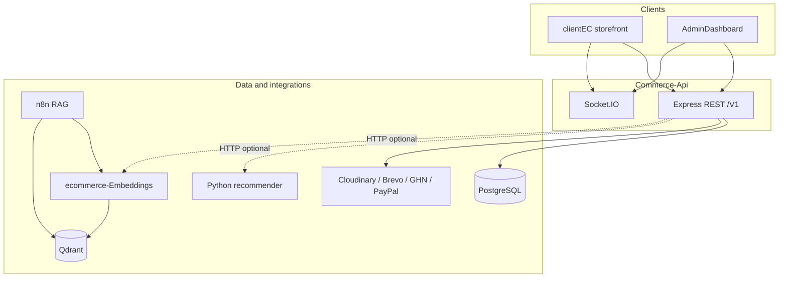

# Commerce API

> **Backend tập trung** cho nền tảng TMĐT — **Express 5**, **TypeScript**, **PostgreSQL**, **Prisma ORM**, **Socket.IO**. Cung cấp REST **`/V1`** cho storefront (**clientEC**) và back-office (**AdminDashboard**): xác thực JWT (HttpOnly cookie), RBAC, đơn hàng, thanh toán, GHN, tích hợp **Python recommender**, **AI Chat RAG** qua n8n + ecommerce-Embeddings + Qdrant, và **telemetry** tùy chọn.


---

## Vị trí trong hệ sinh thái



- **Một API duy nhất** phục vụ cả khách và admin (phân tách bằng **role** + **permission** + route).
- **Socket.IO** gắn chung **HTTP server** trong [`src/server.ts`](src/server.ts) — client kết nối cùng host/cổng với API (bỏ path `/V1` ở phía client).
- **Sản phẩm chi tiết** hỗ trợ cả `id` và `slug` qua `GET /V1/products/details/:identifier` để không làm gãy URL cũ.

---

## Mục lục

- [Kiến trúc runtime](#kiến-trúc-runtime)
- [Cấu trúc thư mục](#cấu-trúc-thư-mục)
- [Lớp xử lý request](#lớp-xử-lý-request)
- [Database & Prisma](#database--prisma)
- [Tích hợp ngoài](#tích-hợp-ngoài)
- [Gợi ý sản phẩm & telemetry](#gợi-ý-sản-phẩm--telemetry)
- [Biến môi trường](#biến-môi-trường)
- [Cài đặt & vận hành](#cài-đặt--vận-hành)
- [Kiểm thử](#kiểm-thử)
- [Tài liệu thêm](#tài-liệu-thêm)

---

## Kiến trúc runtime

1. **`server.ts`:** `connectDB()` (Prisma) → `express()` → `cookie-parser`, **CORS**, `express.json()` → mount **`/V1`** → `errorHandlingMiddleware` → **`http.createServer` + `initSocket(httpServer)`**.
2. **Graceful shutdown:** `SIGINT` / `SIGTERM` / `SIGUSR2` → `disconnectDB()`.
3. **Base path API:** mọi route nghiệp vụ nằm dưới **`/V1`** (xem [`src/routes/V1/index.ts`](src/routes/V1/index.ts)).

### Tiện ích nội bộ

| Route | Mục đích |
|-------|----------|
| `GET /V1/status` | Kiểm tra router sống |
| `GET /V1/health` | Health + ping PostgreSQL |

---

## Cấu trúc thư mục (rút gọn)

```
Commerce-Api/
├── prisma/
│   ├── schema.prisma
│   └── migrations/
├── src/
│   ├── server.ts              # Entry
│   ├── config/                # env, prisma, cors, socket
│   ├── routes/V1/             # Router theo domain (REST)
│   ├── controllers/
│   ├── services/              # Logic nghiệp vụ (+ recommendation*, recommenderIndex*)
│   ├── models/                # Truy vấn Prisma / abstraction
│   ├── middlewares/           # auth, RBAC, rate limit, multer, error
│   ├── validations/           # Zod
│   ├── providers/             # JWT, Passport OAuth, Cloudinary, Brevo
│   ├── helpers/               # PayPal, …
│   ├── constants/             # rbac, …
│   ├── types/
│   ├── utils/
│   └── tests/                 # Vitest (order, payment, recommendation, …)
└── docs/                      # OAuth, session, payment, …
```

---

## Lớp xử lý request

```
HTTP → Router → (middleware: auth / permission / validate) → Controller → Service → Model/Prisma → PostgreSQL
```

- **Xác thực:** JWT access (cookie / header); refresh token; session trong DB.
- **RBAC:** `constants/rbac`, middleware `requirePermission`, role Admin bypass (chi tiết trong code).
- **Validation:** Zod trong `validations/*`.
- **Lỗi:** `ApiError` + `errorHandlingMiddleware` thống nhất response.

### Nhóm REST chính (`/V1/...`)

| Prefix | Nội dung |
|--------|----------|
| `/categories` | Danh mục |
| `/products` | Sản phẩm, upload ảnh, **similar** (proxy recommender), chi tiết theo `id` hoặc `slug` |
| `/ai-chat` | Proxy chat RAG sang n8n, trả về `reply + sources` |
| `/recommendation-events` | Telemetry impression/click (lưu DB) |
| `/users` | Auth, profile, OAuth callback, session |
| `/vouchers` | Voucher |
| `/orders` | Đơn (user + admin) |
| `/shipping-addresses` | Địa chỉ |
| `/shipping` | GHN / địa lý |
| `/cart`, `/wishlist` | Giỏ, wishlist |
| `/reviews` | Đánh giá |
| `/contacts` | Liên hệ |
| `/notifications` | Thông báo |
| `/payments` | PayPal (và luồng liên quan) |
| `/roles`, `/permissions` | RBAC admin |

*(Danh sách đầy đủ: các file trong [`src/routes/V1/`](src/routes/V1/).)*

---

## Database & Prisma

- **ORM:** Prisma 7 + `@prisma/adapter-pg`.
- **Schema:** [`prisma/schema.prisma`](prisma/schema.prisma) — các model nghiệp vụ cho người dùng, sản phẩm, đơn hàng, thanh toán, voucher, notification, shipping, quyền hạn, telemetry, v.v.

---

## Tích hợp ngoài

| Dịch vụ | Vai trò |
|---------|---------|
| **Cloudinary** | Ảnh sản phẩm / avatar |
| **Brevo** | Email giao dịch / xác minh |
| **GHN** | Vận chuyển (shipping quote, địa chỉ) |
| **PayPal** | Thanh toán (REST + helpers) |
| **OAuth** | Google / Facebook (Passport, `providers/passport.ts`) |
| **n8n + ecommerce-Embeddings + Qdrant** | AI Chat RAG / search vector / reindex sản phẩm |

---

## Gợi ý sản phẩm, RAG & telemetry

- **`recommendationService`:** gọi microservice **Python** (`RECOMMENDER_API_URL`) cho `GET .../products/similar/:id`; fallback cùng danh mục nếu service lỗi.
- **`recommenderIndexService`:** sau CRUD sản phẩm (khi bật env), debounce gọi `POST .../recommendations/reindex` trên Python (header `X-Reindex-Key` nếu cấu hình secret).
- **`embeddingIndexService`:** sau CRUD sản phẩm (khi bật env), debounce gọi `POST .../v1/index/reindex` trên `ecommerce-Embeddings` để đồng bộ Qdrant.
- **`aiChatService`:** proxy chat RAG qua `N8N_AI_CHAT_WEBHOOK_URL`; workflow n8n sẽ gọi `ecommerce-Embeddings` rồi trả `reply + sources`.
- **`recommendationEventService`:** lưu batch sự kiện từ storefront (`POST /V1/recommendation-events`).

Chi tiết vận hành Python: repo **ecommerce-recomendation** (FastAPI) cho recommender và repo **ecommerce-Embeddings** (FastAPI) cho embeddings + Qdrant.

### Luồng AI chat RAG

1. `clientEC` gọi `POST /V1/ai-chat`.
2. `Commerce-Api` proxy sang `N8N_AI_CHAT_WEBHOOK_URL`.
3. n8n gọi `ecommerce-Embeddings` (`POST /v1/search`) để lấy context từ Qdrant.
4. n8n gọi LLM (Groq/Ollama theo workflow) rồi trả về JSON chuẩn:
    - `reply`: nội dung markdown của AI
    - `sources`: danh sách sản phẩm liên quan

### Reindex sản phẩm và slug

- `GET /V1/products/details/:identifier` hỗ trợ cả `id` lẫn `slug`.
- Script `pnpm db:fix-slugs` dùng khi cần chuẩn hóa lại slug cũ trong database.
- Khi đổi tên sản phẩm, `slug` mới sẽ được cập nhật và luồng reindex embeddings sẽ đồng bộ lại đường dẫn.

---

## Biến môi trường

Tạo `.env` từ [`.env.example`](.env.example). Một số nhóm:

| Nhóm | Ví dụ |
|------|--------|
| App | `DATABASE_URL`, `DATABASE_DIRECT_URL`, `LOCAL_DEV_APP_PORT` (mặc định **8017** dev), `BUILD_MODE` |
| JWT | `JWT_ACCESS_SECRET`, `JWT_REFRESH_SECRET`, TTL |
| Recommender | `RECOMMENDER_API_URL`, `RECOMMENDER_REINDEX_ENABLED`, `RECOMMENDER_REINDEX_SECRET` |
| AI Chat RAG | `N8N_AI_CHAT_WEBHOOK_URL`, `AI_CHAT_WEBHOOK_TIMEOUT_MS`, `AI_CHAT_INTERNAL_SECRET`, `EMBEDDINGS_SERVICE_URL`, `EMBEDDINGS_REINDEX_ENABLED`, `EMBEDDINGS_REINDEX_SECRET` |
| Cloudinary / Brevo / OAuth / GHN / PayPal | Xem `.env.example` |

**CORS:** `CORS_WHITELIST` — origin storefront + admin (production).

---

## Cài đặt & vận hành

**Yêu cầu:** Node ≥ 18, PostgreSQL, `pnpm`.

```bash
pnpm install
cp .env.example .env
# chỉnh DATABASE_URL và secrets

pnpm db:migrate      # hoặc db:push (dev)
pnpm db:generate
pnpm db:fix-slugs    # chuẩn hóa slug sản phẩm/danh mục khi cần
pnpm dev
```

```bash
pnpm build
pnpm start           # BUILD_MODE=production
pnpm run render:build   # generate + migrate deploy + build (Render)
```

Script hữu ích: `db:studio`, `db:seed`, `db:fix-slugs`, `type-check`, `lint`.

---

## Kiểm thử

- **Vitest:** `pnpm test` — unit/service (đơn hàng, thanh toán, recommendation, recommender index, embeddings index, middleware tùy chọn).
- Không thay thế test tích hợp / E2E trên môi trường staging.

---

## Tài liệu thêm

Thư mục [`docs/`](docs/) — OAuth, session, payment, email, v.v. File mục lục: [`docs/README.md`](docs/README.md).

---

## Tác giả

**DHVuxDev** — License MIT (theo `package.json`).

---

<p align="center">Một API — nhiều client; realtime Socket.IO; tùy chọn recommender Python.</p>
