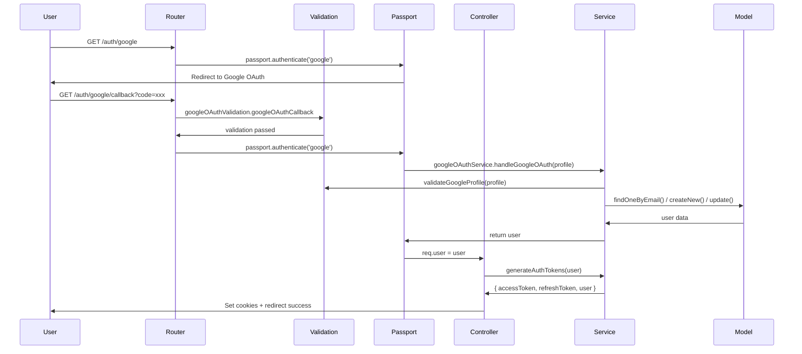

# 📋 Cấu trúc Google OAuth với Controller-Service Pattern

## 🏗️ Kiến trúc phân tầng

```
┌─────────────────┐    ┌─────────────────┐    ┌─────────────────┐
│   Router        │ -> │   Controller    │ -> │   Service       │
│ (userRouter.js) │    │(userController) │    │(googleOAuthSvc) │
└─────────────────┘    └─────────────────┘    └─────────────────┘
         |                       |                       |
         v                       v                       v
┌─────────────────┐    ┌─────────────────┐    ┌─────────────────┐
│   Validation    │    │   Passport      │    │   UserModel     │
│(googleOAuthVal) │    │ (passport.js)   │    │  (Database)     │
└─────────────────┘    └─────────────────┘    └─────────────────┘
```

## 📁 Các file và trách nhiệm

### 1. **Router Layer** (`src/routes/V1/userRouter.js`)

- **Trách nhiệm**: Định nghĩa endpoints và middleware chain
- **Routes**:
  - `GET /auth/google` - Khởi tạo OAuth flow
  - `GET /auth/google/callback` - Xử lý callback từ Google
  - `GET /auth/google/failure` - Xử lý lỗi OAuth

### 2. **Validation Layer** (`src/validations/googleOAuthValidation.js`)

- **Trách nhiệm**: Validate request và Google profile
- **Functions**:
  - `googleOAuthCallback` - Validate OAuth callback parameters
  - `validateGoogleProfile` - Validate Google profile structure

### 3. **Controller Layer** (`src/controllers/userController.js`)

- **Trách nhiệm**: Xử lý HTTP request/response và điều phối logic
- **Methods**:
  - `googleOAuthSuccess` - Xử lý thành công OAuth
  - `googleOAuthFailure` - Xử lý lỗi OAuth

### 4. **Service Layer** (`src/services/googleOAuthService.js`)

- **Trách nhiệm**: Business logic và xử lý dữ liệu
- **Functions**:
  - `handleGoogleOAuth` - Xử lý thông tin user từ Google
  - `generateAuthTokens` - Tạo JWT tokens

### 5. **Passport Provider** (`src/providers/passport.js`)

- **Trách nhiệm**: Cấu hình Google OAuth strategy
- **Strategy**: GoogleStrategy với callback xử lý profile

## 🔄 Luồng xử lý Google OAuth



## 🛠️ Cách sử dụng

### 1. **Khởi tạo Google OAuth**

```javascript
// Frontend redirect
window.location.href = '/V1/users/auth/google'
```

### 2. **Xử lý success callback**

```javascript
// Trong googleOAuthSuccess controller
const authResult = googleOAuthService.generateAuthTokens(user)
res.cookie('accessToken', authResult.accessToken, options)
res.cookie('refreshToken', authResult.refreshToken, options)
res.redirect(`${env.CLIENT_URL}/auth/success`)
```

### 3. **Xử lý error callback**

```javascript
// Trong googleOAuthFailure controller
res.redirect(`${env.CLIENT_URL}/login?error=${errorMessage}`)
```

## ⚙️ Cấu hình môi trường

```env
# Google OAuth Configuration
GOOGLE_CLIENT_ID=your_google_client_id
GOOGLE_CLIENT_SECRET=your_google_client_secret
GOOGLE_CALLBACK_URL=http://localhost:3000/V1/users/auth/google/callback

# Client URL (Frontend)
CLIENT_URL=http://localhost:3000
```

## 🔒 Security Features

1. **JWT-only Authentication**: Không sử dụng session
2. **Profile Validation**: Validate Google profile structure
3. **Secure Cookies**: httpOnly, secure, sameSite
4. **Error Handling**: Chi tiết log lỗi trong development
5. **Input Validation**: Validate OAuth callback parameters

## 🧪 Testing

### Test Google OAuth Flow:

1. **Start Flow**: `GET /V1/users/auth/google`
2. **Mock Profile**: Test với mock Google profile
3. **Verify Tokens**: Kiểm tra JWT tokens được tạo
4. **Check Database**: Verify user được tạo/cập nhật

### Example Test Data:

```javascript
const mockGoogleProfile = {
  id: '123456789',
  emails: [{ value: 'user@gmail.com' }],
  displayName: 'Test User',
  photos: [{ value: 'https://photo.jpg' }]
}
```

## 📝 Best Practices

1. **Separation of Concerns**: Mỗi layer có trách nhiệm riêng biệt
2. **Error Handling**: Xử lý lỗi ở mọi layer
3. **Validation**: Validate dữ liệu ở cả validation layer và service layer
4. **Logging**: Log chi tiết trong development mode
5. **Security**: Không expose sensitive data trong response
