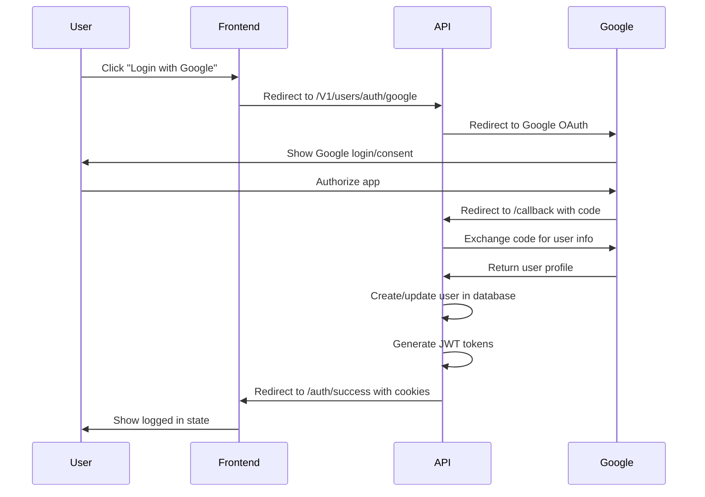

# Google OAuth Setup Guide

## 🚀 Hướng dẫn cấu hình Google OAuth cho đăng nhập

### 1. Tạo Google OAuth Application

1. Truy cập [Google Cloud Console](https://console.cloud.google.com/)
2. Tạo project mới hoặc chọn project hiện có
3. Bật Google+ API:
   - Vào **APIs & Services** > **Library**
   - Tìm "Google+ API" và bật nó
4. Tạo OAuth 2.0 credentials:
   - Vào **APIs & Services** > **Credentials**
   - Click **Create Credentials** > **OAuth client ID**
   - Chọn **Web application**
   - Điền thông tin:
     - **Name**: Commerce API OAuth
     - **Authorized JavaScript origins**: `http://localhost:8017` (dev) / `https://yourdomain.com` (prod)
     - **Authorized redirect URIs**: `http://localhost:8017/V1/users/auth/google/callback`

### 2. Cấu hình Environment Variables

Thêm vào file `.env`:

```bash
# Google OAuth Configuration
GOOGLE_CLIENT_ID=your_google_client_id_here
GOOGLE_CLIENT_SECRET=your_google_client_secret_here
GOOGLE_CALLBACK_URL=http://localhost:8017/V1/users/auth/google/callback

# Session Configuration
SESSION_SECRET=your-super-secret-session-key-here

# Client URL (Frontend)
CLIENT_URL=http://localhost:3000
```

### 3. API Endpoints

#### 🔗 Initiate Google OAuth

```
GET /V1/users/auth/google
```

- **Description**: Bắt đầu quá trình đăng nhập Google
- **Usage**: Redirect user đến URL này để bắt đầu OAuth flow

#### 🔄 Google OAuth Callback

```
GET /V1/users/auth/google/callback
```

- **Description**: Endpoint callback sau khi user authorize với Google
- **Auto-handled**: Tự động xử lý và redirect user về frontend

### 4. Flow hoạt động



### 5. Frontend Integration

#### HTML/JavaScript

```html
<a href="http://localhost:8017/V1/users/auth/google" class="google-login-btn">
  Login with Google
</a>
```

#### React

```jsx
const GoogleLoginButton = () => {
  const handleGoogleLogin = () => {
    window.location.href = 'http://localhost:8017/V1/users/auth/google'
  }

  return <button onClick={handleGoogleLogin}>Login with Google</button>
}
```

### 6. Success/Error Handling

#### Success Redirect

- URL: `${CLIENT_URL}/auth/success`
- Cookies được set: `accessToken`, `refreshToken`
- Frontend cần handle route `/auth/success` để:
  - Redirect user về dashboard/home
  - Update auth state

#### Error Redirect

- URL: `${CLIENT_URL}/login?error=oauth_failed`
- Frontend cần check query param `error` để hiển thị thông báo lỗi

### 7. User Data Structure

Khi user đăng nhập bằng Google lần đầu, hệ thống sẽ tạo user mới với:

```javascript
{
  name: "Google Display Name",
  email: "user@gmail.com",
  password: "GOOGLE_AUTH", // Placeholder
  avatar: "https://google-avatar-url.jpg",
  emailVerified: true,
  role: "user",
  isActive: true,
  lastLogin: new Date(),
  // ... other fields
}
```

### 8. Security Features

- ✅ **Session-based**: Sử dụng express-session
- ✅ **Secure Cookies**: HttpOnly, Secure (production)
- ✅ **JWT Integration**: Tự động tạo JWT tokens
- ✅ **User Mapping**: Tự động tạo/update user từ Google profile
- ✅ **Email Verification**: Auto-verify email từ Google

### 9. Testing

#### Development Testing

1. Start server: `npm run dev`
2. Truy cập: `http://localhost:8017/V1/users/auth/google`
3. Login với Google account
4. Kiểm tra redirect về frontend
5. Verify cookies được set

#### Production Checklist

- [ ] Update Google OAuth redirect URIs
- [ ] Set `BUILD_MODE=production`
- [ ] Sử dụng HTTPS cho all redirects
- [ ] Set secure session secret
- [ ] Update CLIENT_URL to production domain

### 10. Troubleshooting

#### Common Issues

**Error: redirect_uri_mismatch**

- Kiểm tra `GOOGLE_CALLBACK_URL` match với Google Console
- Đảm bảo không có trailing slash

**Error: oauth_failed redirect**

- Check server logs cho chi tiết
- Verify Google credentials
- Kiểm tra Google+ API đã được bật

**Session not persisting**

- Verify `SESSION_SECRET` được set
- Kiểm tra cookie settings
- Đảm bảo express-session được cấu hình đúng

### 11. Dependencies

```json
{
  "express-session": "^1.17.x",
  "passport": "^0.6.x",
  "passport-google-oauth20": "^2.0.x"
}
```

## 🎯 Ready to use!

Hệ thống Google OAuth đã được cấu hình hoàn chỉnh và sẵn sàng sử dụng. User có thể đăng nhập bằng Google account và hệ thống sẽ tự động tạo JWT tokens để authenticate các API calls tiếp theo.
