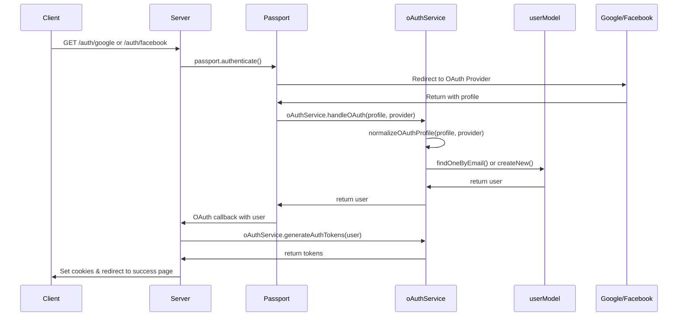

# OAuth Service Architecture

## Tổng quan

Hệ thống OAuth đã được tối ưu hóa để sử dụng một generic service duy nhất (`oAuthService.js`) thay vì các service riêng biệt cho từng provider. Điều này giúp giảm thiểu code duplication và dễ dàng mở rộng cho các OAuth providers mới.

## Kiến trúc

### 1. **Generic OAuth Service** (`src/services/oAuthService.js`)

Service trung tâm xử lý tất cả OAuth providers với các tính năng:

- **Provider Configuration**: Cấu hình cho các providers được hỗ trợ (Google, Facebook)
- **Profile Normalization**: Chuẩn hóa dữ liệu profile từ các providers khác nhau
- **Generic OAuth Handler**: Xử lý logic chung cho tất cả providers
- **Token Generation**: Tạo JWT tokens sau khi OAuth thành công

### 2. **Passport Strategies** (`src/providers/passport.js`)

Cấu hình Passport strategies cho các providers:

- Google OAuth 2.0 Strategy
- Facebook Strategy
- Tất cả đều sử dụng `oAuthService.handleOAuth()` thay vì các service riêng biệt

### 3. **User Controller** (`src/controllers/userController.js`)

Xử lý callback từ OAuth providers và tạo response cho client:

- `googleOAuthSuccess` và `facebookOAuthSuccess` handlers
- Sử dụng `oAuthService.generateAuthTokens()` để tạo JWT

## Luồng hoạt động



## Supported Providers

### Google

- Provider: `'GOOGLE'`
- Type Account: `'GOOGLE'`
- Password Placeholder: `'GOOGLE_AUTH'`

### Facebook

- Provider: `'FACEBOOK'`
- Type Account: `'FACEBOOK'`
- Password Placeholder: `'FACEBOOK_AUTH'`

## API Methods

### `oAuthService.handleOAuth(profile, provider)`

Xử lý OAuth authentication cho bất kỳ provider nào.

### `oAuthService.generateAuthTokens(user)`

Tạo JWT access và refresh tokens.

### `oAuthService.normalizeOAuthProfile(profile, provider)`

Chuẩn hóa profile data từ các providers khác nhau.

### `oAuthService.isSupportedProvider(provider)`

Kiểm tra provider có được hỗ trợ không.

### `oAuthService.getProviderConfig(provider)`

Lấy cấu hình của provider.

## Lợi ích của kiến trúc mới

1. **DRY (Don't Repeat Yourself)**: Loại bỏ code duplication giữa các providers
2. **Scalability**: Dễ dàng thêm provider mới chỉ bằng cách thêm config
3. **Maintainability**: Tập trung logic OAuth ở một nơi, dễ bảo trì
4. **Consistency**: Đảm bảo tất cả providers hoạt động theo cùng một pattern
5. **Testing**: Dễ dàng test hơn với một service duy nhất

## Environment Variables

```bash
# Google OAuth
GOOGLE_CLIENT_ID=your_google_client_id
GOOGLE_CLIENT_SECRET=your_google_client_secret
GOOGLE_CALLBACK_URL=http://localhost:8017/api/v1/users/auth/google/callback

# Facebook OAuth
FACEBOOK_CLIENT_ID=your_facebook_app_id
FACEBOOK_CLIENT_SECRET=your_facebook_app_secret
FACEBOOK_CALLBACK_URL=http://localhost:8017/api/v1/users/auth/facebook/callback

# Client URL for redirects
CLIENT_URL=http://localhost:3000
```

## Routes

```javascript
// Google OAuth
GET / api / v1 / users / auth / google
GET / api / v1 / users / auth / google / callback

// Facebook OAuth
GET / api / v1 / users / auth / facebook
GET / api / v1 / users / auth / facebook / callback
```

## Thêm Provider mới

Để thêm một OAuth provider mới:

1. **Thêm cấu hình vào `OAUTH_PROVIDERS`**:

```javascript
NEW_PROVIDER: {
  name: 'NEW_PROVIDER',
  passwordPlaceholder: 'NEW_PROVIDER_AUTH',
  displayName: 'New Provider Account'
}
```

2. **Thêm case vào `normalizeOAuthProfile`**:

```javascript
case 'NEW_PROVIDER':
  email = profile.emails?.[0]?.value
  displayName = profile.displayName || ''
  avatar = profile.photos?.[0]?.value || ''
  break
```

3. **Thêm Passport Strategy**:

```javascript
passport.use(
  new NewProviderStrategy(
    {
      /* config */
    },
    async (accessToken, refreshToken, profile, done) => {
      const user = await oAuthService.handleOAuth(profile, 'NEW_PROVIDER')
      return done(null, user)
    }
  )
)
```

4. **Thêm routes và controller handlers** tương tự như Google/Facebook
